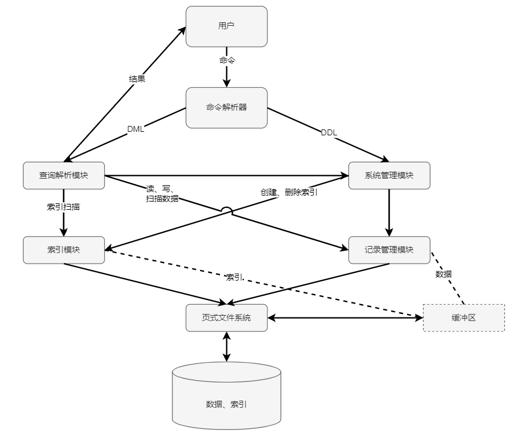

# 项目总结报告

### 1. 介绍

- 基于python3编写
- 小组成员：张哲昕，温佳鑫

### 2. 系统架构设计

完全按照实验文档给出的架构进行实现

### 3. 各模块详细设计及主要接口

#### 3.1 页式文件系统

##### 详细设计

基于LRU算法实现缓存

##### 主要接口

| 接口        | 功能描述       |
| ----------- | -------------- |
| open_file   | 打开文件       |
| close_file  | 关闭文件       |
| remove_file | 删除文件       |
| create_file | 创建文件       |
| read_page   | 读取一页       |
| write_page  | 写入一页       |
| new_page    | 创建新页并写入 |

#### 3.2 记录管理

##### 详细设计

- 第一页写入header信息
- 用bitmap维护页内的record占用情况
- 额外的bit记录每条记录的每一列是否是NULL

##### 主要接口

| 接口          | 功能描述                               |
| ------------- | -------------------------------------- |
| create_file   | 创建并初始化（写入header信息）记录文件 |
| get_record    | 取出一条记录                           |
| update_record | 更新一条记录                           |
| insert_record | 插入一条记录                           |
| delete_record | 删除一条记录                           |

#### 3.3 索引

##### 详细设计

- 实现基于B+树的索引

##### 主要接口

| 接口         | 功能描述             |
| ------------ | -------------------- |
| create_index | 创建并初始化索引文件 |
| open_index   | 打开索引文件         |
| close_index  | 关闭索引文件         |
| insert       | 插入一个节点         |
| remove       | 删除一个节点         |
| rangeSearch  | 按范围查询           |

#### 3.4 查询解析

##### 详细设计

- 先执行单表查询
- 再执行基于hash join的多表查询，具体来说，会先将表按照查询到的记录数目从小到大排序，然后逐一进行当前表和之前所有表的join操作，并对当前表建立hash字典，key是要满足的condition（condition必须一个表是当前表，另一个表是之前的所有表中的一个）对应的列，value是完整的记录，然后逐一遍历之前所有表得到的结果，利用key对hash字典进行查找，得到当前表满足约束条件的记录，更新结果。实际测试可以将5表join的时间降低到3-5分钟完成，而朴素的先得到5表的所有记录组合再进行过滤的做法一天内都无法完成。

##### 主要接口

| 接口                         | 功能描述                |
| ---------------------------- | ----------------------- |
| search_records_using_indexes | 单表查询                |
| cond_join                    | 基于hash join的多表查询 |

#### 3.5 系统管理

##### 详细设计

- 用`meta system`维护数据库的元信息

##### 主要接口

| 接口         | 功能描述             |
| ------------ | -------------------- |
| create_table | 建表                 |
| drop_table   | 删表                 |
| create_db    | 建库                 |
| drop_db      | 删库                 |
| use_db       | 改变当前使用的数据库 |

#### 3.6 命令行解析

##### 详细设计

- 基于antlr实现
- 对分号做了特殊处理，支持多行输入
- 额外考虑了exit指令和捕捉ctrl+c，以完成数据库的退出
- 加入了read指令，读取一个文件中的所有指令并执行

##### 主要接口

- 即antlr封装的接口

### 4. 实验结果

实现了全部必做功能

实现了部分选做功能，具体包括

- 多表join：3、4、5表JOIN
- 所有高级查询
- 高级索引：unique约束
- 高级完整性约束：NULL

### 5. 小组分工

分工上，对于每个模块都共同讨论、写代码，工作量差不多。

### 6. 参考文献

无
